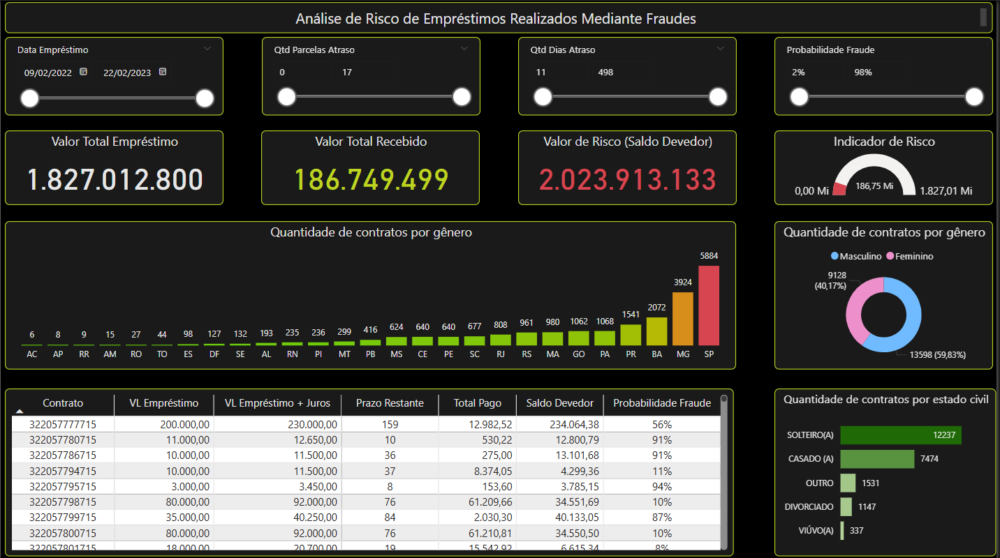

# 📊 Projeto de Previsão de Inadimplência em Financiamentos

Este projeto tem como objetivo analisar e prever a inadimplência em operações de financiamento utilizando técnicas de ciência de dados, visualizações interativas com Power BI e um pipeline de machine learning em Python.

[](https://github.com/leojoker/projeto-inadimplencia-financiamento/blob/main/LICENSE)
[](https://www.python.org/)
[](https://app.powerbi.com/view?r=eyJrIjoiMTk0ZDVmMDEtZGQxYS00MjVkLTgxODktNGY2ZDdmZjhjZWQwIiwidCI6IjI3MTA1ZGYzLTBhYmItNGMyMy05NmQyLTk2N2FiMmEyNmQ5YSJ9)

---

## 📚 Sumário

- [🎯 Objetivos](#🎯-objetivos)
- [🖼️ Visualização do Dashboard](#🖼️-visualização-do-dashboard)
- [🧠 Tecnologias Utilizadas](#🧠-tecnologias-utilizadas)
- [📂 Estrutura do Projeto](#📂-estrutura-do-projeto)
- [🚀 Como Executar o Projeto](#🚀-como-executar-o-projeto)
- [🤝 Como Contribuir](#🤝-como-contribuir)
- [👨‍💻 Autor](#👨‍💻-autor)
- [📝 Licença](#📝-licença)

---

## 🎯 Objetivos

- Analisar padrões e variáveis associadas à inadimplência.
- Construir e treinar modelos de machine learning para classificação de risco.
- Implantar um pipeline de machine learning com previsões automáticas.
- Criar visualizações gerenciais em Power BI para tomada de decisão.

---

## 🖼️ Visualização do Dashboard



📌 Acesse o dashboard interativo:  
👉 [Visualizar no Power BI](https://app.powerbi.com/view?r=eyJrIjoiMTk0ZDVmMDEtZGQxYS00MjVkLTgxODktNGY2ZDdmZjhjZWQwIiwidCI6IjI3MTA1ZGYzLTBhYmItNGMyMy05NmQyLTk2N2FiMmEyNmQ5YSJ9)

---

## 🧠 Tecnologias Utilizadas

- **Python**: linguagem principal para processamento, modelagem e automação.
- **Jupyter Notebook**: para prototipagem e análise exploratória.
- **Scikit-learn**: construção e avaliação dos modelos de machine learning.
- **Joblib**: serialização do modelo treinado.
- **Power BI**: criação de dashboards interativos e visualmente atrativos.
- **Git/GitHub**: versionamento de código e colaboração.

---

## 📂 Estrutura do Projeto

```
projeto-inadimplencia-financiamento/
├── app/                        # Script para execução de previsões
├── data/                       # Bases de dados (raw, processed, final)
├── images/                     # Imagens do projeto (dashboard etc.)
├── models/                     # Armazenamento de modelos
├── notebooks/                  # Notebooks para exploração e pipeline
├── src/                        # Código-fonte modularizado
├── tests/                      # Testes unitários
├── requirements.txt            # Pacotes e dependências
├── LICENSE                     # Licença do projeto
└── README.md                   # Este arquivo
```

---

## 🚀 Como Executar o Projeto

1. Clone este repositório:
   ```bash
   git clone https://github.com/leojoker/projeto-inadimplencia-financiamento.git
   cd projeto-inadimplencia-financiamento
   ```

2. Crie um ambiente virtual (recomendado):
   ```bash
   python -m venv venv
   source venv/bin/activate     # Linux/Mac
   venv\Scripts\activate.bat    # Windows
   ```

3. Instale as dependências:
   ```bash
   pip install -r requirements.txt
   ```

4. Execute os notebooks na ordem da pasta `/notebooks`, ou rode o script de previsão:
   ```bash
   python app/gerar_previsoes_inadimplencia.py
   ```

---

## 🤝 Como Contribuir

1. Faça um fork do repositório
2. Crie uma branch com sua feature: `git checkout -b minha-feature`
3. Faça commit das alterações: `git commit -m 'feat: Minha nova funcionalidade'`
4. Envie para o GitHub: `git push origin minha-feature`
5. Abra um Pull Request

---

## 👨‍💻 Autor

**Leonardo Barbosa**  
Cientista de Dados com foco em Finanças, BI e Machine Learning  
🔗 [LinkedIn](https://www.linkedin.com/in/leonardo-barbosa777/) | [GitHub](https://github.com/leojoker)

---

## 📝 Licença

Este projeto está licenciado sob os termos da [MIT License](LICENSE).

